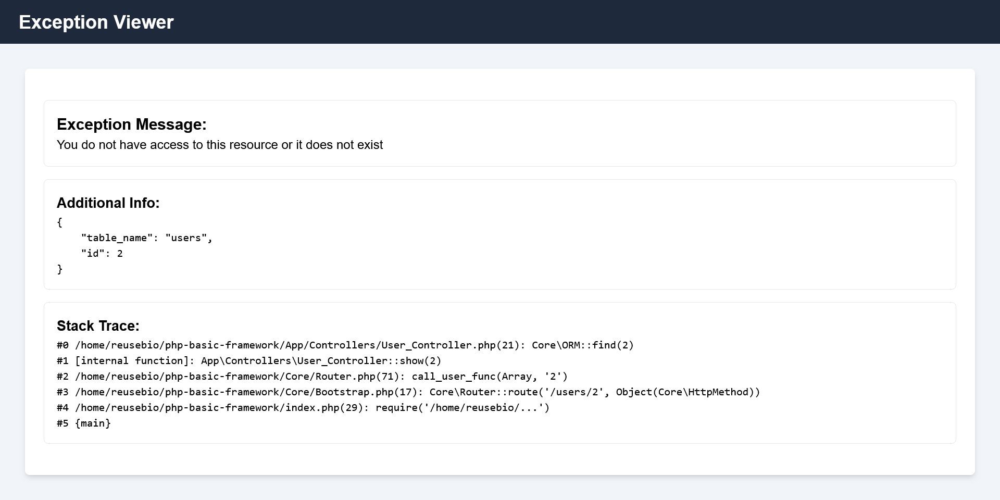

# php-basic-framework

### Spin up

```bash
php -S localhost:8000
```

### Home page


### 404 - Not Found


### Exception Handler during development


### Logger


### To do's

- Improve ORM, currently it is unusable
- Create a wrapper around the php array
    - Create methods like 
        - ->get($key, $default_value);
        - ->set($key, $value);
        - ->filter(fn);
        - ->map(fn);
- Improve the Request Helper (Go to move it from the Core to the Helpers)